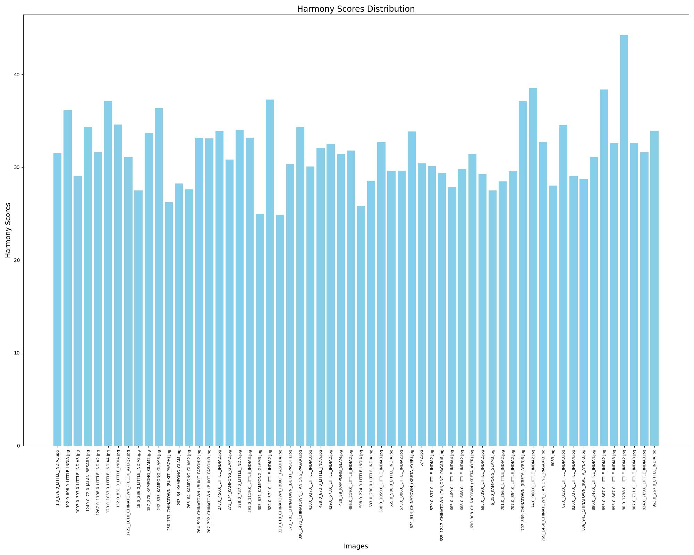

# Color Analysis of Singapore Shophouses

## Getting Started

### Prerequisites

Before you begin, ensure you have met the following requirements:
- Python 3.8 or higher
- Pip or Conda for managing software packages

### Installation

Clone the repository to your local machine:

```bash
git clone https://github.com/your-username/your-repository.git
cd your-repository
```

### Install the required packages
```
pip install -r requirements.txt
```
### Dataset Acquisition

To obtain the datasets used in this project, please visit the following link:

[Download Dataset](https://drive.google.com/drive/folders/17HRaJwDykrcDPTvyUv12mjvVfu0BXLLQ?usp=sharing)

The datasets include:

1. **Ten pairs of shophouse photos taken before and after 1989**
2. **Three groups of GSV images featuring three historical styles**
3. **3103 GSV images distinguished by three districts and 80 streets**
4. **The spatial distribution data of the core areas demarcated by the URA**
5. **Data on types of ethnic languages displayed on street billboards**

## Usage
You can view and run specific code modules based on different requirements.

## Results

The following results are generated by the project:

### Color Complexity Distribution


### Color Harmony Distribution




## Contribution
Contributions to enhance or expand the project are welcome. Please follow these steps:

1.Fork the repository.  
2.Create a new branch (git checkout -b feature-branch).  
3.Make changes and commit (git commit -am 'Add some feature').  
4.Push to the branch (git push origin feature-branch).  
5.Create a new Pull Request.  
